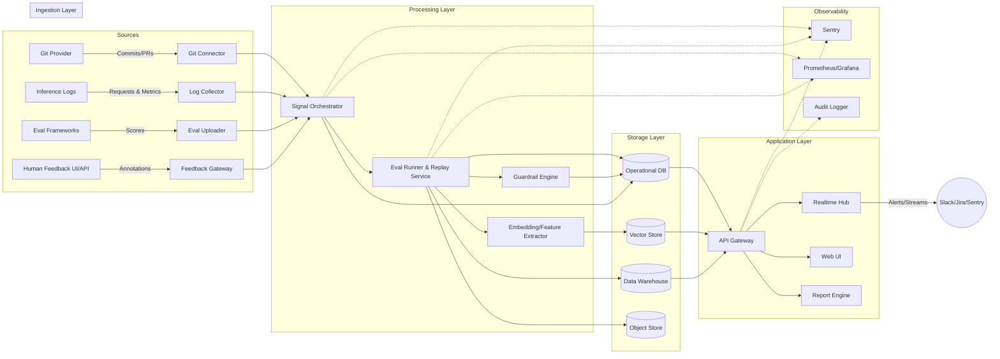

Eval Signal Center — UI & Architecture Overview
===============================================

Part 1 — Sample UI Concept
--------------------------

### Screen Lineup

| Screen | Primary Persona | Purpose | Key Metrics/Widgets |
| --- | --- | --- | --- |
| Executive Pulse Dashboard | Head of AI/ML | Morning health check on quality, cost, reliability | Net Eval Score delta, traffic volume, token spend, latency p95, incident count, regression highlights |
| Auto-Triggered Experiment Summary | Staff engineer | Confirm impact of latest prompt/model change | Baseline vs treatment cards, diff snippet, KPI deltas, rollout status, shadow traffic coverage |
| Regression Alert Workflow | On-call platform engineer | Triage guardrail breaches and assign owners | Alert detail, suspect commits, dataset impact, mitigation actions, Slack/Sentry hooks |
| Deep Dive Comparison | Product PM | Understand trade-offs before approval | Metric tables, waterfall contribution chart, failure case gallery, evaluator notes, download options |
| Human Feedback Lens | Annotation lead | Track reviewer throughput and quality | Rubric score trends, inter-rater agreement, queue status, cost per label, sampling controls |
| Weekly Workflow Review | Leadership team | Align on velocity and open risks | Experiment velocity graph, improvement rate, outstanding regressions, upcoming releases |

### Annotated Wireframe Sketches

**Executive Pulse Dashboard**

```
+--------------------------------------------------------------------------------+
| Top Bar: Eval Signal Center | Filters: Product ▾ | Model ▾ | Time ▾ | Alerts 🔔 |
+--------------------------------------------------------------------------------+
| KPI Strip: [Net Eval Score ▲4.2] [Latency p95 820ms ▼6%] [Token Cost $1.27 ▲1%]|
|           [Incidents 1 ⚠] [Traffic 48k req]                                      |
+--------------------------------------------------------------------------------+
| Timeline Heatmap (accuracy / hallucination / latency bands)                    |
| Regression markers: ● Signal-1280  | ● Signal-1279 (resolved)                  |
+----------------------------------------------+---------------------------------+
| Left Pane: Active Signals list               | Right Pane: Incident Spotlight  |
| - Signal-1280 (Warning)                      | Hallucination spike +5 pts      |
| - Signal-1278 (Healthy)                      | Suspect commits: 4ac12f, b83aa4 |
|                                              | Suggested action: hold rollout  |
|                                              | Button: View Experiment         |
+--------------------------------------------------------------------------------+
| Activity Feed (commits, eval runs, feedback submissions)                       |
+--------------------------------------------------------------------------------+
```

**Auto-Triggered Experiment Summary**

```
+-------------------------------------------------------------+
| Signal-1280 — "Customer Support Bot: empathetic tone v2"    |
| Status: Warning | Rollout: 30% shadow | Owner: Alice Chen   |
+-------------------------------------------------------------+
| Metrics vs Baseline                                         |
| Accuracy      ▲ +3.1 pts   | Hallucination ▼ -1.2 pts       |
| Latency p95   ▲ +90 ms     | Token Cost ▲ +$0.07            |
+-------------------------------------------------------------+
| Change Diff                                                  |
| Prompt diff: + Added empathy instructions                    |
| Model diff : GPT-4o-mini → Claude 3.5 Sonnet                 |
| Config diff: temperature 0.7 → 0.6                           |
+-------------------------------------------------------------+
| Shadow Traffic Snapshot                                     |
| 5,000 requests | Success 96% | Guardrails triggered 7        |
| Button: View Failure Cases | Button: Promote to 100%        |
+-------------------------------------------------------------+
| Notifications                                                |
| - Slack #ai-core: metric summary posted                     |
| - GitHub PR comment linked                                  |
+-------------------------------------------------------------+
```

**Regression Alert Workflow**

```
+----------------------------------------------+
| ⚠ Regression Alert — Hallucination Guardrail |
| Workflow: Support Bot | Detected: 09:42 UTC   |
+----------------------------------------------+
| Suspect Signals                               |
| - Signal-1280 (hallucination rate +5.2 pts)  |
| - Signal-1279 (no change)                    |
+----------------------------------------------+
| Impacted Datasets                             |
| - escalations_eval_set (fail 8/120 cases)    |
| - billing_queries (fail 4/60)                |
+----------------------------------------------+
| Recommended Actions                           |
| [Hold rollout] [Assign owner] [Open in Sentry]|
| Owner: ___________________ (dropdown)         |
+----------------------------------------------+
| Incident Timeline                             |
| 09:10 Eval run completed                      |
| 09:12 Guardrail triggered                     |
| 09:18 Auto-ticket filed in Jira               |
+----------------------------------------------+
```

Additional screens follow similar patterns with focused widgets (e.g., waterfall charts, feedback queue widgets).

### Hero User Flow — “Prompt Change to Insight”

1. Engineer merges a prompt PR; CI triggers Signal pipeline.
2. Eval Runner replays curated datasets, seeds shadow traffic, logs metrics to Eval Store.
3. Aggregator compares results to baseline, pushes summary to Executive Dashboard and Slack.
4. If guardrail breached (hallucination, latency, cost), Regression Alert workflow spins up an incident with suspect commits and remediation tasks.
5. PM opens Deep Dive Comparison screen, reviews failure cases, and decides to iterate or promote.
6. Annotation lead checks Human Feedback Lens to allocate reviewers for the next cycle.
7. Leadership sync uses Weekly Workflow Review to track throughput and outstanding risks.

Part 2 — System Architecture
----------------------------

### Component Overview

| Layer | Components | Responsibilities |
| --- | --- | --- |
| Ingestion | Git Connector, Log Collector, Eval Uploader, Feedback API | Pull commit metadata, capture inference logs, accept eval outputs (automated + human), normalize into event envelopes |
| Processing | Signal Orchestrator, Eval Runner, Guardrail Engine, Feature Extractor | Trigger eval jobs on change, replay datasets, compute metrics, derive embeddings for semantic search, evaluate guardrails |
| Storage | Operational DB (Postgres), Vector Store (pgvector/Weaviate), Data Warehouse (Snowflake/BigQuery), Object Store (S3) | Persist workflow metadata, index semantic traces, power analytics, archive raw artifacts |
| Application | GraphQL/REST API, Realtime Service (WebSockets), UI Web App, Report Generator | Serve dashboards, enable filtering, push alerts, craft weekly reports |
| Observability | Sentry, Prometheus/Grafana, Audit Logger | Monitor platform health, capture errors, ensure traceability |
| Integrations | Slack, Jira, GitHub PR comments, PagerDuty | Close-loop notifications and ticketing |

### High-Level Architecture Flow



### Data Management Notes

- **Operational DB (Postgres + pgvector extension or equivalent)**: stores workflows, signals, incidents, metric snapshots, and embeddings for nearest-neighbor search of similar regressions.
- **Data Warehouse**: powers historical analytics and weekly reporting (experiment velocity, improvement rate). Batch jobs sync from Postgres and object store.
- **Vector Store**: indexes prompts, context documents, and evaluation artifacts to enable semantic lookup of related failure cases or similar incidents.
- **Object Store**: archives raw logs, test datasets, evaluation artifacts, and attachable assets (screenshots, reviewer notes).

### Processing Details

- **Signal Orchestrator** (Argo Workflows / Temporal): listens for change events, routes to appropriate eval suites, manages retries and rollbacks.
- **Eval Runner**: spins up replay jobs on Kubernetes or serverless workers, fetches datasets, uses vector store for context retrieval, records results.
- **Guardrail Engine**: evaluates configurable thresholds (accuracy deltas, hallucination rate, latency, cost) and writes incidents; publishes to Sentry for high-severity regressions.
- **Embedding Extractor**: generates embeddings for prompts, responses, evaluator comments; supports semantic clustering of regression cases.

### Observability & Governance

- **Sentry**: captures platform-side errors and links incidents to underlying signals; integrates with on-call rotation.
- **Prometheus/Grafana**: monitors system-level metrics (worker utilization, queue depth).
- **Audit Logger**: maintains immutable change log for compliance (who promoted a model, who dismissed an alert).

### Deployment Considerations

- Containerized microservices orchestrated via Kubernetes; autoscale eval runners based on queue depth.
- Separate VPC/subnets for ingestion vs. processing; private networking to vector DB and warehouse.
- Secrets managed via Vault or cloud KMS; all customer data encrypted at rest and in transit.
- Multi-tenant isolation at schema level with optional VPC peering for enterprise customers.

### Next Architectural Milestones

1. Prototype ingestion connectors (Git, inference proxy, manual CSV upload) to validate data model.
2. Implement Signal Orchestrator MVP with replay support for top 2 eval suites.
3. Stand up UI skeleton using Executive Pulse Dashboard layout and integrate realtime metric updates via WebSockets.
4. Instrument Sentry and Prometheus from day one to ensure platform observability.

Ingestion Connector Prototype Plan
----------------------------------

### Objectives

- Validate the unified event schema by wiring three initial connectors: Git provider webhook consumer, inference logging proxy, and manual CSV evaluator.
- Ensure events land in the Operational DB within 5 minutes of occurrence and surface in a basic metrics table.
- Provide replayable fixtures to support downstream Signal Orchestrator development.

### Common Event Envelope

| Field | Type | Notes |
| --- | --- | --- |
| `event_id` | UUID | Generated by connector; dedupe key |
| `source` | Enum (`git`, `inference`, `eval_csv`) | Connector identifier |
| `event_type` | String | e.g. `commit.pushed`, `inference.logged`, `eval.uploaded` |
| `workflow_id` | UUID (nullable) | Linked once workflow detected; Git connector sets using repo mapping |
| `payload` | JSONB | Raw source payload normalized into schema-specific structure |
| `ingested_at` | Timestamp | UTC ingestion time |
| `trace_context` | JSONB | Correlation IDs (PR number, request_id, dataset_id) |
| `processing_status` | Enum (`pending`, `processed`, `errored`) | Updated by Signal Orchestrator |

### Git Connector Prototype

- **Integration**: Register webhook for push, PR merge, tag events; support GitHub & GitLab via shared handler.
- **Processing Flow**:
  1. Webhook request hits API Gateway; JWT signature validation.
  2. Connector maps repo → workflow metadata (via config table) to populate `workflow_id`.
  3. Extract commit info (hash, author, files changed, message, timestamps).
  4. For PR merge, capture PR number, labels, reviewers, CI status.
  5. Emit event with `event_type` `commit.pushed` or `pr.merged` and stash diff summary in payload.
- **Data Contract (payload.commit)**:
  ```json
  {
    "repo": "support-bot-prompts",
    "branch": "main",
    "commit_hash": "4ac12f5",
    "author": {
      "name": "Alice Chen",
      "email": "alice@example.com"
    },
    "files_changed": ["prompts/support.yaml", "config/model.json"],
    "message": "Improve empathy tone prompts",
    "pull_request": {
      "number": 428,
      "merged_by": "pmiller",
      "labels": ["prompt-change", "eval-required"],
      "ci_status": "success"
    }
  }
  ```
- **Prototype Validation**:
  - Use ngrok or tunnel to point GitHub webhook to local container.
  - Replay fixture payloads to ensure event persisted with correct schema.
  - Trigger sample downstream job to confirm `processing_status` toggles to `processed`.

### Inference Logging Proxy Prototype

- **Goal**: Capture live and replay traffic without requiring teams to re-instrument entire stack.
- **Architecture Options**:
  - **Reverse proxy**: Provide lightweight gateway (FastAPI/Go) deployed in front of provider (OpenAI, Anthropic) to log requests/responses.
  - **SDK wrapper**: Offer drop-in library for Python/TypeScript that wraps SDK calls and sends logs asynchronously.
- **Prototype Approach**: Build reverse proxy first for deterministic data; support API key passthrough.
- **Processing Flow**:
  1. Client sends LLM request to proxy; proxy records metadata (request_id, timestamp, model, prompt hash, context references).
  2. Proxy forwards request to upstream model provider, streams response back to caller.
  3. On completion, proxy emits `inference.logged` event with latency, token counts, guardrail flags (if available), and attaches `workflow_id` via API token mapping.
  4. Raw request/response stored in object store (for replays) with pointer ID in payload.
- **Data Contract (payload.inference)**:
  ```json
  {
    "request_id": "req_97f2",
    "model": "gpt-4o",
    "prompt_hash": "sha256:ab12...",
    "context_doc_ids": ["kb/support/faq-12"],
    "latency_ms": 820,
    "tokens_input": 320,
    "tokens_output": 210,
    "cost_usd": 0.015,
    "status": "success",
    "response_store_uri": "s3://eval-signal/inference/req_97f2.json",
    "trace": {
      "user_id": "user_723",
      "session_id": "sess_554",
      "signal_id": "Signal-1280"
    }
  }
  ```
- **Prototype Validation**:
  - Simulate traffic via curl/postman to proxy; verify events persisted and object store record created.
  - Ensure sensitive fields (PII) can be redacted based on configurable allowlist.
  - Confirm mapping table (API key → workflow) attaches correct `workflow_id`.

### Manual CSV Eval Upload Prototype

- **Purpose**: Allow teams without automated pipelines to upload eval results while data model matures.
- **Interface**: Web UI component + REST endpoint accepting CSV/JSON.
- **CSV Template Fields**:
  | Column | Description |
  | --- | --- |
  | `dataset_id` | Identifier for eval set |
  | `model_version` | Semantic version or commit hash |
  | `prompt_commit` | Optional Git hash reference |
  | `metric_name` | e.g. `accuracy`, `hallucination_rate` |
  | `metric_value` | Numeric |
  | `sample_id` | (optional) row-level reference |
  | `notes` | Free text or rubric summary |
  | `created_at` | Timestamp |
- **Processing Flow**:
  1. User uploads CSV through UI; file stored in object store with upload metadata.
  2. Connector validates header, coercing numeric fields, rejects rows with missing `metric_name/value`.
  3. For each unique combination of dataset/model_version, build aggregated metrics and emit `eval.uploaded` event with summary stats and pointer to raw artifact.
  4. Attach `workflow_id` by matching model_version or prompt_commit to latest Git event.
- **Prototype Validation**:
  - Provide downloadable CSV template; include sample dataset in repo for testing.
  - On upload, UI displays parsed summary, error list, and final ingest status.
  - Downstream, ensure metrics materialize in analytics warehouse for weekly reporting.

### Connector Deployment & Tooling

- Package connectors as independent services managed by Kubernetes/Helm; share common libraries for auth, schema validation, retry logic.
- Use Kafka or AWS SNS/SQS as optional intermediate queue; for prototype, direct write to Postgres with retry/backoff.
- Instrument each service with Sentry and Prometheus to capture ingestion failures and latency.
- Maintain fixture library (`/fixtures/ingestion/`) with canonical payloads for CI regression tests.

### Validation Checklist

1. **Schema verification**: Automated tests confirm event envelope shape and required fields per connector.
2. **Latency**: Measure end-to-end ingestion time (event creation → DB write) under load; target <2 minutes P95 for Git/inference events.
3. **Idempotency**: Replayed webhook or retry does not duplicate events (check `event_id` or upstream delivery ID).
4. **Security**: Secrets stored in Vault; connectors support per-tenant API keys and TLS termination.
5. **Observability**: Dashboards showing ingest rate, error rate, and backlog depth.

### Roadmap After Prototype

- Add additional sources (LangSmith, Helicone, Datadog traces) via connector interface.
- Introduce schema registry/versioning to handle payload evolution.
- Enable backfill jobs to rehydrate historical commits/eval results into unified store.

Action Layer & Integrations
---------------------------

### Positioning with Existing Observability Tools

- Treat Sentry/Datadog/LangSmith as upstream signal providers: we ingest their alerts, traces, or experiment results via connectors to enrich the Eval Signal timeline instead of duplicating their functionality.
- Focus our UI on AI-specific diagnostics—metric deltas, prompt/model context, feedback loops—while deep log inspection remains in the specialized tools (link-outs embedded in Regression Alert workflow).
- Offer optional bidirectional hooks:
  - When we detect an eval regression, automatically file a Sentry issue or Datadog event with context (signal ID, suspect commits, guardrail breached).
  - Pull severity and resolution status back from those tools to close the loop inside our dashboard.

### Closed-Loop Response Workflow

1. **Detect** — Guardrail engine compares new eval metrics against baselines; regression flagged with suspect commits, datasets, and traffic slices.
2. **Triage** — Action panel provides one-click access to:
   - Create/assign Jira or Linear ticket with pre-filled impact summary.
   - Trigger targeted re-run (e.g., focus dataset, higher sampling) to confirm regression.
   - Launch pre-configured Datadog dashboard or Sentry trace for deeper infra inspection.
3. **Respond** — Operators choose mitigation:
   - Hold rollout or revert to previous prompt/model version via Git automation hook.
   - Adjust guardrail thresholds or dataset weighting.
   - Request additional human review through Feedback Lens queue.
4. **Validate** — System watches for recovered metrics; once stable, marks incident resolved and posts summary to Slack/weekly report.

### Automation Playbooks

- **Auto-Rerun Playbook**: On detection, queue a narrower eval suite (e.g., top 50 failure cases) to confirm the signal before paging humans.
- **Rollback Playbook**: Provide API endpoint that toggles feature flag / model version in deployment platform (LaunchDarkly, AWS AppConfig) and logs action in audit trail.
- **Feedback Boost Playbook**: Automatically assign high-impact samples to annotators when disagree rate spikes.
- **Release Gate**: Integrate with CI/CD to block promotion if Net Eval Score falls below threshold or unresolved regression exists.

### Surfacing the “What Next” in UI

- Regression Alert screen includes **Recommended Actions** ranked by confidence (built from historical resolution metadata).
- Deep Dive Comparison shows suggested hypotheses (e.g., “Cost increase driven by longer responses—consider truncation guardrail”).
- Weekly Workflow Review highlights outstanding regressions with time-open, owner, and next recommended step so leadership can enforce follow-through.

### Business Value Messaging

- Customers keep their investment in Datadog/Sentry for low-level debugging while we deliver the missing AI quality plane—tying every alert to the specific model or prompt change that triggered it.
- We reduce mean-time-to-diagnosis for AI regressions by automating detection, triage, and response playbooks, turning scattered tooling into a cohesive evaluation workflow.
